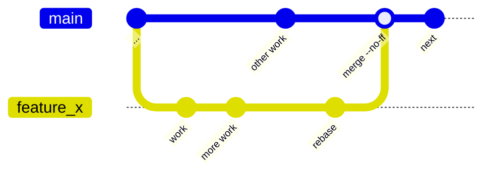
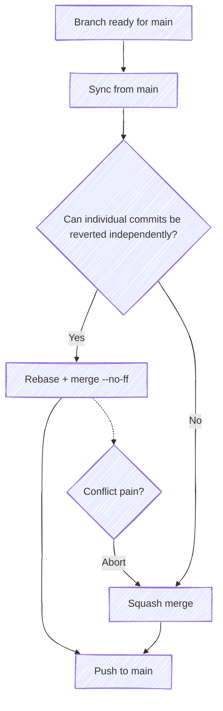

# My Git Workflow

This is not meant to be prescriptive — just how I use `git`. Sharing in case others find it useful.



## Branch Early

Shift mindset to **branch early**.

About to do something (even something small)?

```bash
git checkout -b feature_x
```

It doesn't cost anything, and gives you an opportunity to catch mistakes without impacting others.

## Stay Current

Rebase often from `main` into your branch:

```bash
git pull -p; git rebase origin/main
```

Doing this pays down your "merge debt" as you go as opposed to leaving it all for the end.

## Releasing

When you've got a branch that's ready for mainline, sync once more from main, and then choose from the following merge options.



### Rebase Option (preferred)

Choose this option when you have discrete commits that you want to preserve — could individual commits be reverted independently?

```bash
git rebase origin/main
git checkout main
git merge feature_x --no-ff
git push
```

`rebase` stacks up all your changes "on top of" `main`:

- Emphasizes your changes (as if they happened now at the HEAD of `main`)
- Creates git histories that you can visualize (related commits grouped together)
- Orders git history by when features were _merged_ (not when individual code fragments were written)

`--no-ff` creates a commit for the merge itself so that you can easily revert the entire feature.

If you end up in "rebasing mode" where you're solving conflicts over and over, consider aborting (`git rebase --abort`) and squashing instead.

### Squash Option

Choose this option if the feature is atomic — it's all or nothing.

```bash
git checkout main
git merge feature_x --squash
git commit -m "<message describing entire change set>"
git push
```

## Considerations

How the branch is shared has implications to which methods you might favor.

**Working alone:** go nuts — `git commit --amend` and `git rebase -i` to your heart's content.

**Working with others:** try to avoid `git rebase` as it mutates commits which can conflict when they `git pull`. An exception is when you want to rebase from mainline — just communicate that you're doing so.

Once you've shared code out for review, avoid mutating history as it invalidates what has been reviewed. When you've incorporated all the feedback, however, tidying up the history with judicious commit amendments/consolidations is fair game.
